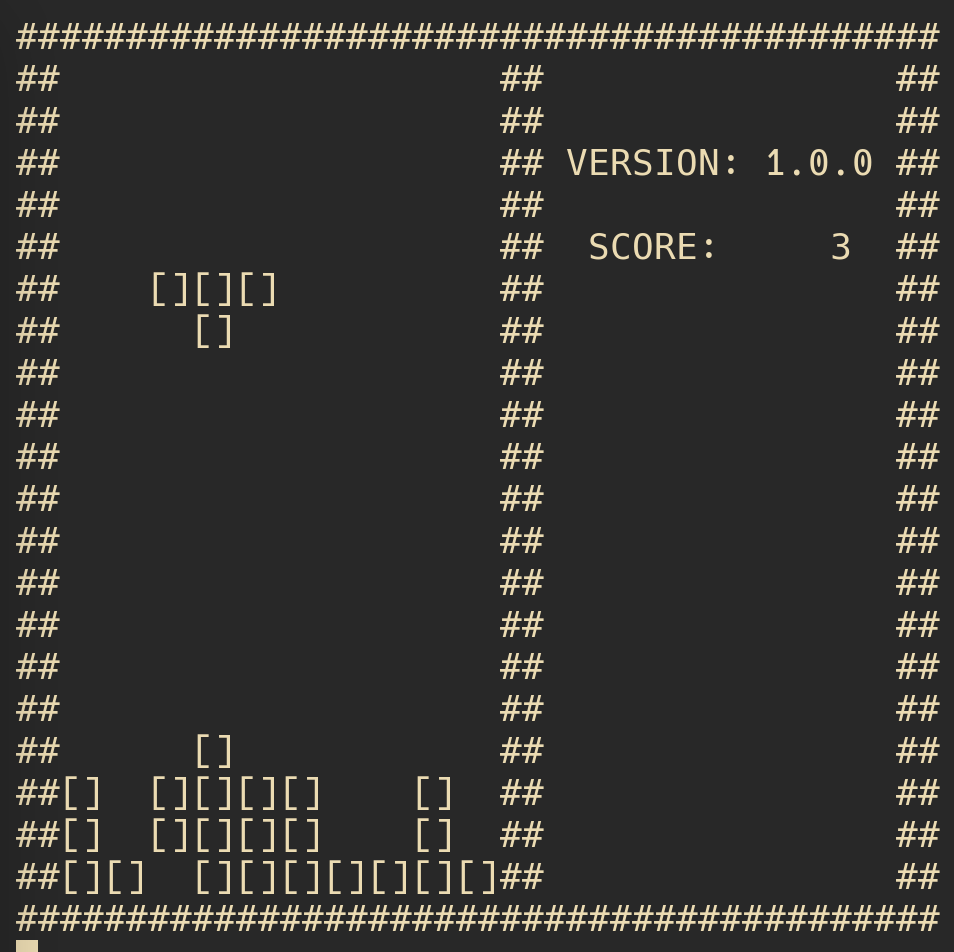

# Tetris.cpp

Terminal Tetris in C++.



## How to play

Build from source:

```bash
./build.sh release
```

By default, the executable is `./build/bin/ttetris`.
The game will run in a 42x22 terminal window.
Control key bindings:

- `h`: move left
- `l`: move right
- `j`: move down
- `k`: rotate
- `p`: pause
- `q`: quit

## Design Overview

Architecture Overview:

```none
+---------------------+
|      const.hpp      | <- Global constants, type aliases
+---------------------+
          |
          V
+---------------------+
|      core.hpp       | <- Public interface for board and piece
+---------------------+
          |
          V
  +----------------+        +-----------------+
  | core_board.cpp | <----- | Board mechanics |
  +----------------+        +-----------------+
          ↓
  +----------------+        +-----------------+
  | core_piece.cpp | <----- | Piece FSM logic |
  +----------------+        +-----------------+
```

### Key Components

Types:

- `field_t`: A 10×20 1D array as a dense representation of all pixels on the
  board.
- `brick_t`: Sparse 1D 4-index representation of a tetromino.

Structures:

- `core::Board`

  - key members
    - `base`: landed blocks (static)
    - `active`: current falling piece overlay
  - responsibilities
    - Track game progress (`lines`, `next`, `last_fall`)
    - Merge pieces into the board
    - Detect and clear full lines
    - Render board state (`ToString`)

- `core::Piece`
  - members
    - `cur`: current piece blocks
    - `left`, `right`, `down`: one-move transformations
    - `rotate`: rotated position
    - `round`: nearby cells for collision detection
  - methods
    - initialize from seed (`Spawn`)
    - Transform state (`Left`, `Right`, `Down`, `Rotate`)
    - Maintain precomputed directional states for efficiency

### Brick Rotation State Machine

Each `Piece.state` represents a orientation variant changed by rotation, and
transitions are encoded in:

- `kMapState2Next` (state transition map)
- `kMapState2FnRotate` (rotation functions)
- `kMapState2FnAround` (collision area update)

Movement and rotation states are updated **before** action execution:

- Improves runtime efficiency
- Simplifies collision checks

Direction helpers for safe index access, and always return `IDX_NA` for illegal
moves:

- `l(idx)`: left cell
- `r(idx)`: right cell
- `u(idx)`: above cell
- `d(idx)`: below cell

To add a new tetromino:

- Add new `enum class State` entries
- Increase `kNType` and `kNState`
- Extend:

  - `kMapState2Next` for state transitions
  - `kMapBrickInit` for initial position
  - `kMapState2FnRotate` for rotation logic
  - `kMapState2FnAround` for rotation collision detection

### Game Logic

- `collide(...)`

  - Boundary detection (checks for index validity)
  - Collision with occupied cells on the board

- `step(...)`: Main game loop tick:

  - If 1 second has passed since `last_fall`, try to move piece down
  - If blocked, `Land()` it and spawn new piece
  - Return `true` on game over
